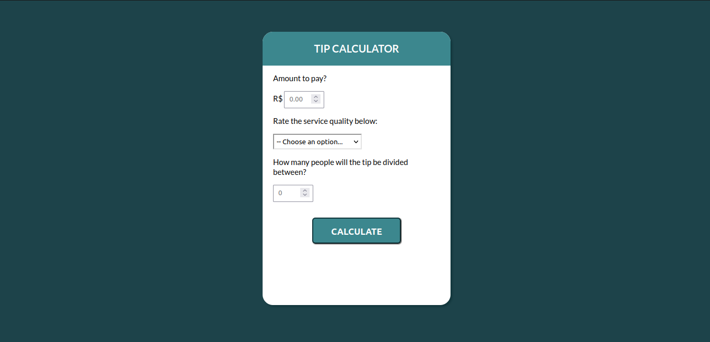
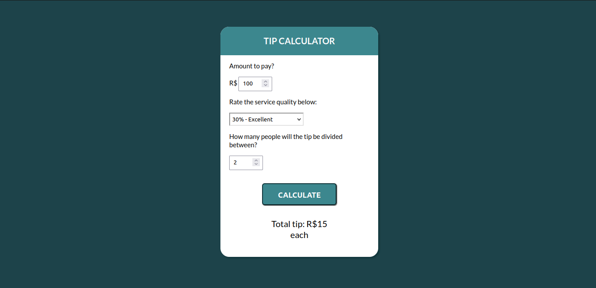

# TIPS CALCULATOR

The goal of the project is to create a tip calculator using HTML, CSS and JavaScript.

## Techonologies

## Description

The calculator must receive the following information:

- Account value
- Percentage related to the quality of service
- Number of people present

And then the tip amount that each person will have to pay will be calculated and refunded at the end.

### How will the tip be calculated?

<strong>(Account amount x Satisfaction percentage) / Number of people </strong>

## Project in browser

## Contacts

 
     
  

